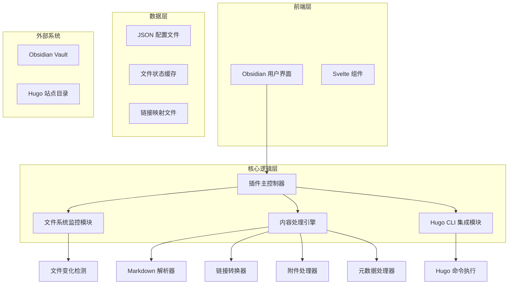
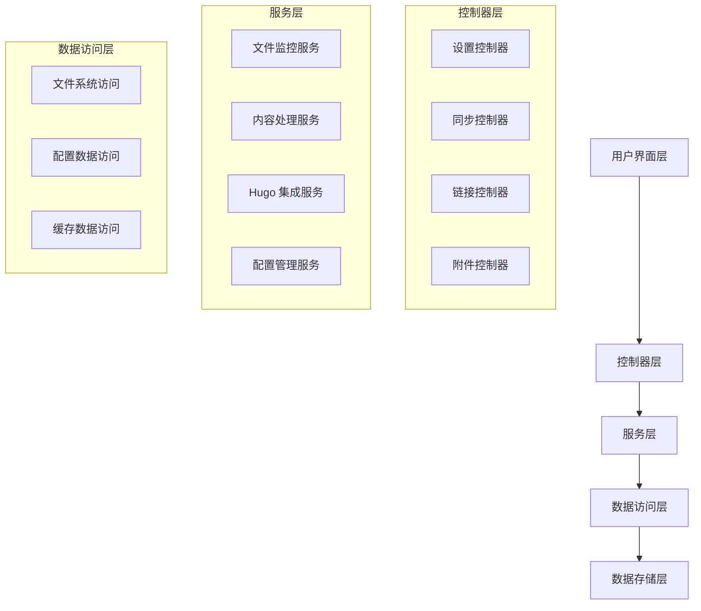

# Hugo-Obsidian 集成插件技术架构文档

## 1. 架构设计



## 2. 技术描述

* 前端：TypeScript + Svelte + Obsidian Plugin API

* 核心逻辑：TypeScript + Node.js APIs

* 数据存储：JSON 配置文件 + 文件系统缓存

* 外部集成：Hugo CLI + 文件系统 API

## 3. 路由定义

| 路由             | 用途                       |
| -------------- | ------------------------ |
| /settings      | 插件设置页面，配置 Hugo 站点路径和同步规则 |
| /sync-panel    | 同步控制面板，显示同步状态和操作控制       |
| /link-manager  | 链接管理页面，管理内部链接转换和验证       |
| /asset-manager | 附件管理页面，处理附件同步和路径映射       |
| /logs          | 日志查看页面，显示同步历史和错误信息       |

## 4. API 定义

### 4.1 核心 API

**文件同步相关**

```typescript
// 同步单个文件
POST /api/sync/file
```

请求参数：

| 参数名称         | 参数类型    | 是否必需  | 描述               |
| ------------ | ------- | ----- | ---------------- |
| filePath     | string  | true  | Obsidian 文件的相对路径 |
| force        | boolean | false | 是否强制覆盖目标文件       |
| processLinks | boolean | false | 是否处理内部链接转换       |

响应参数：

| 参数名称           | 参数类型      | 描述            |
| -------------- | --------- | ------------- |
| success        | boolean   | 同步操作是否成功      |
| targetPath     | string    | Hugo 站点中的目标路径 |
| processedLinks | number    | 处理的链接数量       |
| errors         | string\[] | 错误信息列表        |

示例请求：

```json
{
  "filePath": "notes/技术笔记/Hugo学习.md",
  "force": false,
  "processLinks": true
}
```

示例响应：

```json
{
  "success": true,
  "targetPath": "content/posts/hugo-learning.md",
  "processedLinks": 3,
  "errors": []
}
```

**链接转换相关**

```typescript
// 转换内部链接
POST /api/links/convert
```

请求参数：

| 参数名称     | 参数类型   | 是否必需 | 描述                          |
| -------- | ------ | ---- | --------------------------- |
| content  | string | true | 包含 Obsidian 链接的 Markdown 内容 |
| basePath | string | true | 当前文件的基础路径                   |

响应参数：

| 参数名称             | 参数类型           | 描述               |
| ---------------- | -------------- | ---------------- |
| convertedContent | string         | 转换后的 Markdown 内容 |
| linkMappings     | LinkMapping\[] | 链接映射记录           |

**附件处理相关**

```typescript
// 处理附件同步
POST /api/assets/sync
```

请求参数：

| 参数名称      | 参数类型   | 是否必需  | 描述                |
| --------- | ------ | ----- | ----------------- |
| assetPath | string | true  | 附件在 Obsidian 中的路径 |
| targetDir | string | false | Hugo 站点中的目标目录     |

响应参数：

| 参数名称       | 参数类型    | 描述            |
| ---------- | ------- | ------------- |
| success    | boolean | 附件同步是否成功      |
| targetPath | string  | Hugo 站点中的目标路径 |
| publicUrl  | string  | 附件的公开访问 URL   |

## 5. 服务架构图



## 6. 数据模型

### 6.1 基于文件系统的数据存储

插件采用完全基于文件系统的存储方案，符合 Obsidian 和 Hugo 的核心理念：

```
.obsidian/plugins/hugo-obsidian/
├── config.json              # 主配置文件
├── sync-rules.json          # 同步规则配置
├── file-mappings.json       # 文件路径映射
├── link-cache.json          # 链接转换缓存
├── asset-mappings.json      # 附件路径映射
└── sync-history.json        # 同步历史记录
```

### 6.2 JSON 数据结构定义

**主配置文件 (config.json)**

```json
{
  "hugoSitePath": "/path/to/hugo/site",
  "contentDir": "content",
  "staticDir": "static",
  "autoSync": true,
  "theme": "default",
  "createdAt": "2024-01-01T00:00:00Z",
  "updatedAt": "2024-01-01T00:00:00Z"
}
```

**同步规则配置 (sync-rules.json)**

```json
{
  "rules": [
    {
      "id": "rule-1",
      "pattern": "*.md",
      "action": "include",
      "enabled": true
    },
    {
      "id": "rule-2",
      "pattern": ".obsidian/**",
      "action": "exclude",
      "enabled": true
    }
  ]
}
```

**文件路径映射 (file-mappings.json)**

```json
{
  "mappings": {
    "notes/技术笔记/Hugo学习.md": {
      "hugoPath": "content/posts/hugo-learning.md",
      "contentHash": "abc123def456",
      "lastSynced": "2024-01-01T12:00:00Z",
      "status": "synced"
    }
  }
}
```

**链接转换缓存 (link-cache.json)**

```json
{
  "linkMappings": {
    "notes/技术笔记/Hugo学习.md": [
      {
        "originalLink": "[[Obsidian插件开发]]",
        "convertedLink": "/posts/obsidian-plugin-dev/",
        "linkType": "internal"
      }
    ]
  }
}
```

**附件路径映射 (asset-mappings.json)**

```json
{
  "assetMappings": {
    "attachments/image.png": {
      "hugoPath": "static/img/image.png",
      "assetType": "image",
      "fileSize": 102400,
      "lastSynced": "2024-01-01T12:00:00Z"
    }
  }
}
```

**同步历史记录 (sync-history.json)**

```json
{
  "history": [
    {
      "id": "sync-1",
      "filePath": "notes/技术笔记/Hugo学习.md",
      "operation": "create",
      "success": true,
      "errorMessage": null,
      "timestamp": "2024-01-01T12:00:00Z"
    }
  ]
}
```

