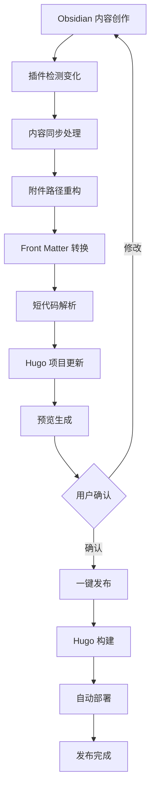

# Hugo-Obsidian 集成插件产品需求文档

## 1. 产品概述

Hugo-Obsidian 集成插件是一个专为知识工作者和内容创作者设计的无缝集成解决方案，旨在打通 Obsidian 笔记管理和 Hugo 静态站点生成之间的工作流壁垒。

该插件解决了用户在使用 Obsidian 进行内容创作时，需要手动处理文件格式转换、附件管理、链接重构等繁琐操作才能发布到 Hugo 站点的痛点问题。通过自动化的内容同步、智能的路径管理和双向链接支持，让用户能够专注于内容创作本身，实现从想法到发布的一键式工作流。

目标市场价值：为个人博客作者、技术文档维护者、知识管理从业者提供高效的内容发布解决方案，预计可提升内容发布效率 80% 以上。

## 2. 核心功能

### 2.1 用户角色

| 角色 | 注册方式 | 核心权限 |
|------|----------|----------|
| 内容创作者 | 安装 Obsidian 插件 | 可创建、编辑内容，使用基础同步功能 |
| 站点管理员 | 配置 Hugo 项目集成 | 可管理发布设置、自定义同步规则、配置高级功能 |

### 2.2 功能模块

本插件需求包含以下主要功能页面：

1. **插件设置页面**：Hugo 项目配置、同步规则设置、路径映射管理
2. **内容同步面板**：实时同步状态、冲突解决、批量操作
3. **附件管理界面**：附件预览、路径重构、格式转换
4. **双向链接图谱**：链接关系可视化、相关内容推荐
5. **发布工作流面板**：一键发布、预览生成、部署状态监控

### 2.3 页面详情

| 页面名称 | 模块名称 | 功能描述 |
|----------|----------|----------|
| 插件设置页面 | Hugo 项目配置 | 设置 Hugo 项目路径、配置文件解析、主题兼容性检测 |
| 插件设置页面 | 同步规则管理 | 配置文件过滤规则、Front Matter 映射、自动标签生成 |
| 插件设置页面 | 路径映射设置 | 定义 Obsidian 到 Hugo 的目录映射关系、文件命名规则 |
| 内容同步面板 | 实时同步监控 | 显示同步状态、进度条、错误日志、成功统计 |
| 内容同步面板 | 冲突解决工具 | 检测文件冲突、提供合并选项、版本对比功能 |
| 内容同步面板 | 批量操作中心 | 批量同步、批量删除、批量重命名、批量标签管理 |
| 附件管理界面 | 附件预览器 | 支持图片、PDF、视频预览、元数据显示 |
| 附件管理界面 | 路径重构工具 | 自动修复链接、路径标准化、相对路径转换 |
| 附件管理界面 | 格式转换器 | 图片压缩优化、格式转换、WebP 支持 |
| 双向链接图谱 | 链接关系图 | 可视化显示笔记间链接关系、支持缩放和筛选 |
| 双向链接图谱 | 相关内容推荐 | 基于链接关系推荐相关文章、智能标签建议 |
| 发布工作流面板 | 一键发布功能 | 集成 Hugo 构建命令、自动部署到 Git、Vercel 等平台 |
| 发布工作流面板 | 预览生成器 | 本地预览服务、移动端适配检查、SEO 优化建议 |
| 发布工作流面板 | 部署监控 | 部署状态跟踪、错误报告、性能分析 |

## 3. 核心流程

### 内容创作者工作流
1. 在 Obsidian 中正常创作内容，使用双向链接和附件
2. 插件自动检测内容变化，实时同步到 Hugo 项目目录
3. 系统自动处理 Front Matter 转换、附件路径重构、短代码解析
4. 用户在发布面板中预览效果，确认无误后一键发布
5. 插件自动触发 Hugo 构建和部署流程

### 站点管理员工作流
1. 安装插件后进行初始配置，设置 Hugo 项目路径和同步规则
2. 配置自定义短代码映射、主题兼容性设置
3. 设置自动化发布流程，包括 Git 集成和部署平台配置
4. 监控同步状态，处理冲突和错误
5. 定期优化同步规则和性能设置

## 4. 用户界面设计

### 4.1 设计风格

- **主色调**：深蓝色 (#1e293b) 和亮蓝色 (#3b82f6)，与 Obsidian 深色主题保持一致
- **辅助色**：成功绿 (#10b981)、警告橙 (#f59e0b)、错误红 (#ef4444)
- **按钮样式**：圆角矩形，支持悬停动画效果
- **字体**：系统默认字体，代码区域使用等宽字体 Consolas/Monaco
- **布局风格**：卡片式布局，左侧导航 + 右侧内容区域
- **图标风格**：使用 Lucide 图标库，保持简洁现代感

### 4.2 页面设计概览

| 页面名称 | 模块名称 | UI 元素 |
|----------|----------|----------|
| 插件设置页面 | Hugo 项目配置 | 文件路径选择器、配置验证状态指示器、主题兼容性检测卡片 |
| 插件设置页面 | 同步规则管理 | 规则列表表格、添加/编辑规则对话框、Front Matter 映射编辑器 |
| 内容同步面板 | 实时同步监控 | 进度条、状态徽章、日志滚动区域、统计数据卡片 |
| 内容同步面板 | 冲突解决工具 | 文件对比视图、合并选项按钮组、版本历史时间线 |
| 附件管理界面 | 附件预览器 | 缩略图网格、详情侧边栏、元数据表格、操作按钮组 |
| 双向链接图谱 | 链接关系图 | SVG 图形画布、缩放控制器、筛选器面板、节点详情弹窗 |
| 发布工作流面板 | 一键发布功能 | 大型发布按钮、部署平台选择器、构建日志终端 |

### 4.3 响应式设计

插件主要面向桌面端 Obsidian 用户，采用桌面优先的设计策略。界面支持窗口大小调整，在较小窗口下采用垂直布局，确保核心功能在不同屏幕尺寸下都能正常使用。考虑到用户可能需要同时查看 Obsidian 和浏览器预览，界面设计支持紧凑模式切换。