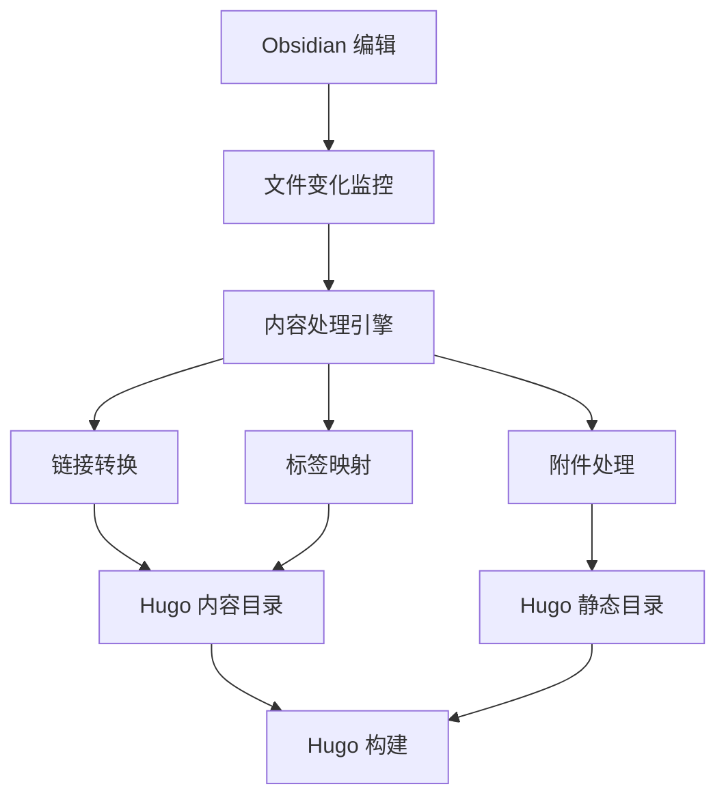

# Hugo-Obsidian 集成插件产品需求文档

## 1. 产品概述

Hugo-Obsidian 集成插件是一个专为 Obsidian 用户设计的插件，旨在实现 Obsidian 知识库与 Hugo 静态站点生成器之间的无缝集成。该插件解决了知识管理与网站发布之间的断层问题，让用户能够直接将 Obsidian 中的笔记、附件和链接结构同步到 Hugo 站点，实现从知识创作到网站发布的一体化工作流。

该产品面向使用 Obsidian 进行知识管理并希望通过 Hugo 发布内容的用户，包括博客作者、技术文档维护者、研究人员等。通过自动化的内容同步和格式转换，显著提升内容发布效率。

## 2. 核心功能

### 2.1 用户角色

| 角色 | 注册方式 | 核心权限 |
|------|----------|----------|
| 普通用户 | 安装插件后直接使用 | 可使用所有基础同步功能、配置插件设置 |
| 高级用户 | 通过配置文件启用高级功能 | 可自定义转换规则、使用 API 扩展功能 |

### 2.2 功能模块

我们的 Hugo-Obsidian 集成插件包含以下主要页面：

1. **设置页面**：插件配置、Hugo 站点路径设置、同步规则配置
2. **同步控制面板**：内容同步状态、手动同步触发、同步历史记录
3. **链接管理页面**：内部链接转换规则、链接映射查看、链接验证
4. **附件管理页面**：附件处理规则、路径映射配置、附件同步状态

### 2.3 页面详情

| 页面名称 | 模块名称 | 功能描述 |
|----------|----------|----------|
| 设置页面 | Hugo 配置模块 | 配置 Hugo 站点根目录、内容目录、静态资源目录路径 |
| 设置页面 | 同步规则模块 | 设置文件过滤规则、标签映射规则、分类映射规则 |
| 设置页面 | 界面设置模块 | 配置插件界面主题、语言设置、通知设置 |
| 同步控制面板 | 实时同步模块 | 监控文件变化、自动触发同步、显示同步状态 |
| 同步控制面板 | 手动同步模块 | 提供全量同步、增量同步、选择性同步选项 |
| 同步控制面板 | 同步历史模块 | 记录同步操作历史、错误日志、回滚功能 |
| 链接管理页面 | 链接转换模块 | 将 Obsidian 内部链接转换为 Hugo 兼容格式 |
| 链接管理页面 | 链接验证模块 | 检查链接有效性、修复断链、生成链接报告 |
| 附件管理页面 | 附件处理模块 | 自动复制附件到 Hugo 静态目录、更新引用路径 |
| 附件管理页面 | 路径管理模块 | 管理附件路径映射、支持自定义路径规则 |

## 3. 核心流程

### 普通用户流程
用户首先在设置页面配置 Hugo 站点路径和基本同步规则，然后在 Obsidian 中正常编辑笔记。插件会自动监控文件变化并触发同步，将修改的内容、新增的附件和更新的链接同步到 Hugo 站点。用户可以在同步控制面板查看同步状态和历史记录。

### 高级用户流程
高级用户除了基础流程外，还可以在链接管理和附件管理页面自定义转换规则，配置复杂的路径映射和过滤条件。通过 API 接口可以集成第三方工具，实现更复杂的工作流自动化。

## 4. 用户界面设计

### 4.1 设计风格

- **主色调**：遵循 Obsidian 原生主题色彩方案，支持明暗主题切换
- **次要色彩**：使用 Obsidian 的强调色（紫色 #7c3aed）和成功色（绿色 #10b981）
- **按钮样式**：采用 Obsidian 原生按钮样式，圆角 4px，支持悬停和激活状态
- **字体**：使用 Obsidian 默认字体栈，中文优先显示思源黑体或系统默认
- **布局风格**：采用 Obsidian 原生的侧边栏和面板布局，支持拖拽调整
- **图标风格**：使用 Lucide 图标库，与 Obsidian 保持一致

### 4.2 页面设计概览

| 页面名称 | 模块名称 | UI 元素 |
|----------|----------|----------|
| 设置页面 | Hugo 配置模块 | 文件夹选择器、路径输入框、验证状态指示器 |
| 设置页面 | 同步规则模块 | 标签选择器、规则编辑器、预览面板 |
| 同步控制面板 | 实时同步模块 | 状态指示灯、进度条、实时日志显示 |
| 同步控制面板 | 手动同步模块 | 同步按钮组、选项复选框、确认对话框 |
| 链接管理页面 | 链接转换模块 | 链接列表、转换规则表格、批量操作按钮 |
| 附件管理页面 | 附件处理模块 | 附件缩略图、路径映射表、同步状态图标 |

### 4.3 响应式设计

插件界面采用桌面优先设计，主要适配 Obsidian 桌面版本。界面支持窗口大小调整，在较小窗口下会自动折叠次要信息，保持核心功能的可用性。所有交互元素支持键盘导航，符合无障碍设计标准。