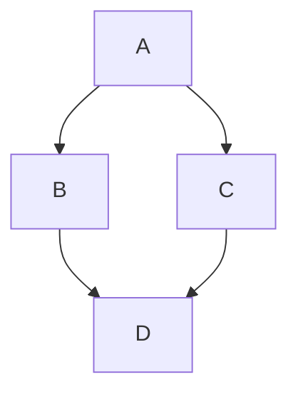
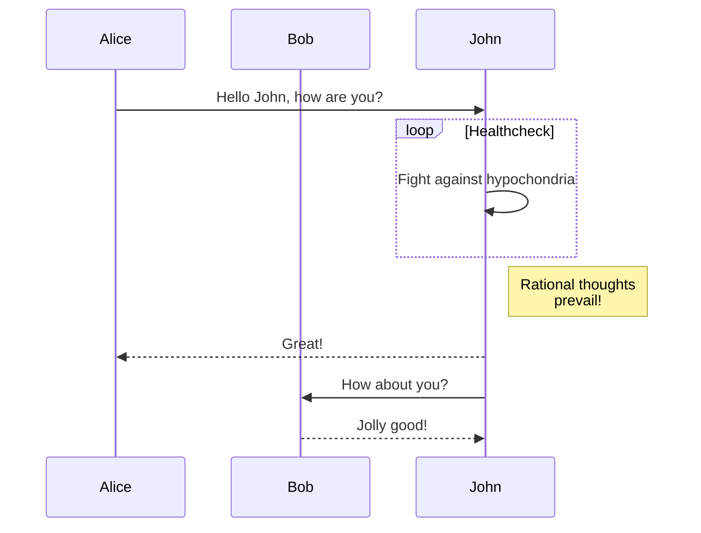

+++
aliases = ['/tech/hugo/diagrams/']
date = '2022-07-09T23:08:54+08:00'
description = '在 Hugo 中使用图表：用 GoAT 语法绘制 ASCII 图表并推荐 Diagon 在线生成器，用 Mermaid 编写流程图、时序图，文中附立方体、光线折射等示例代码。'
draft = false
tags = ['Hugo', 'Diagram']
title = 'Diagrams'
+++
## 图表

### GoAT 图表 (Ascii)

GoAT 图表可以通过[这个网站](https://arthursonzogni.com/Diagon/#code_area "Diagon: ASCII art diagram generator")生成

```text
                                                                             .
    0       3                          P *              Eye /         ^     /
     *-------*      +y                    \                +)          \   /  Reflection
  1 /|    2 /|       ^                     \                \           \ v
   *-------* |       |                v0    \       v3           --------*--------
   | |4    | |7      |                  *----\-----*
   | *-----|-*       +-----> +x        /      v X   \          .-.<--------        o
   |/      |/       /                 /        o     \        | / | Refraction    / \
   *-------*       v                 /                \        +-'               /   \
  5       6      +z              v1 *------------------* v2    |                o-----o
                                                               v
```

### Mermaid 图

Mermaid 图表参考[官网](https://mermaid-js.github.io/mermaid/#/) 进行编辑

#### 流程图



#### 时序图 #待办


