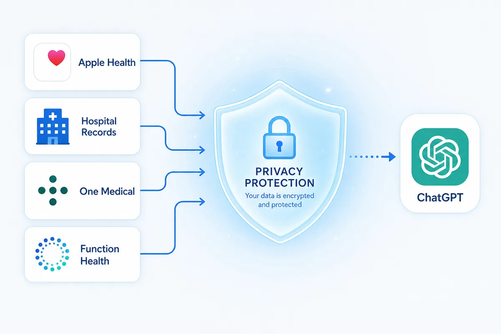

+++
aliases = ['/chatgpt-health-data/']
date = '2026-07-24'
description = 'OpenAI 发布『Health in ChatGPT』：ChatGPT 可连接 Apple Health 与医疗记录。本文不聊 AI 看病，而是聚焦更新条款里真正值钱的部分——3 亿用户的健康数据入口意味着什么。'
tags = ['技术', '观点']
title = 'ChatGPT 开始接入健康数据，但真正值钱的不是医疗问答'
+++
2026年7月23日，OpenAI 发布了一项更新：ChatGPT 可以连接你的 Apple Health 和医疗记录了。它叫 "Health in ChatGPT"。

但这篇文章不会沿着"AI 看病"那条路走。

真正值得关注的东西，藏在那几行小字里。

## 3 亿人已经在问了

每周有超过3亿人用 ChatGPT 问健康问题。——这是 OpenAI 官方公告里的数字。

不是"能看化验单吗"，而是已经在看。不是"会不会用"，而是已经用了。用户在没有任何健康数据接入的情况下，自发地把 ChatGPT 当作健康咨询入口，从理解化验结果到准备就诊问题，从解释医生说的话到制定更健康的日常习惯。

问题在于，这些对话的上下文是断裂的。

病人的病历散落在不同医院的挂号系统里，化验数据埋在 App 的角落，睡眠和心率分布在不同可穿戴设备的后台。每次问 ChatGPT，用户需要手动上传、复述、解释自己的情况——就像每次看新医生都要重新填一遍表。

Health in ChatGPT 做的事情，说白了就是把这些信息连起来。

你可以连接 Apple Health、美国医院系统的电子病历，以及 One Medical（美国连锁会员制诊所）和 Function Health（第三方健康检测平台）。连接后，ChatGPT 能帮你对比新旧化验结果、总结上次就诊以来的变化、分析睡眠和活动之间的关系。更激进的是——它不再要求你进入一个专门的"健康模式"才能用。早期测试数据显示，超过70%的健康对话发生在专用健康空间之外。用户在规划饮食时会希望 ChatGPT 考虑食物过敏，在安排周末活动时想让 AI 知道最近受过伤。

OpenAI 的决定是：把健康数据接入所有对话，而不是锁在一个独立入口里。

这是关键一步。但它不是关于医疗的。

## 隐私声明才是真正的产品

读 OpenAI 的公告，最值得逐字看的不是功能描述，而是隐私条款。

几个事实：

1. **健康数据不用于训练基础模型。** 不管你选了什么模型训练设置，Apple Health 和医疗记录里的数据，以及用到这些数据的对话，都不参与训练、不用于广告。
2. **默认授权。** ChatGPT 每次使用健康数据前，需要你同意。你也可以设为"始终允许"，但关闭这个提示意味着不再逐次确认。
3. **断开即删除。** 断开连接后，数据在 OpenAI 系统内最多保留30天，之后删除。但——对话中已经包含的健康信息，保留到你手动删除那些对话。
4. **记忆系统隔离。** ChatGPT 的 Memory 功能可能从健康对话中形成偏好记忆，但不会直接从连接的医疗记录中提取。
5. **跨插件共享保护。** 如果 ChatGPT 要通过其他插件分享健康数据（比如把训练计划发给跑步搭子），有额外的安全验证，敏感操作需用户额外确认。
6. **红队测试。** OpenAI 对健康信息连接场景进行了专项红队演练。

这六条，放到一起，比功能本身更值得琢磨。

Apple 那一边也一样。Apple Health 的数据只能用密码、Face ID 或 Touch ID 访问，全量加密。App Store 审核明确规定：健康、健身和医疗数据不能用于广告营销，不能拿去挖掘用户行为，不能卖给数据中间商。

说白了，这不是两家公司在比谁的回答更准，而是两个平台正在共同定义一套"健康数据的信任基础设施"。

谁能让用户放心交出最敏感的数据，谁的 AI 就能拿到最深层的上下文。而上下文越深，AI 就越难被替代。

## 当 AI 知道你几点睡

让我们停一下，想一个场景。

你现在打开 ChatGPT，问"我最近睡不好，怎么办"。它给出的答案是一篇通用建议：固定作息、睡前少看屏幕、避免咖啡因。

但如果你接了 Apple Health 呢？

ChatGPT 会知道你上一周的平均入睡时间是凌晨1:42，深度睡眠占比17%，比上个月下降了4个百分点。它会知道你每天早上7点设了三个闹钟，实际起床时间在7:20到7:35之间波动。它会看到你最近三天的运动记录是零。它会读到你的电子病历里有轻度焦虑的诊断记录。

然后它会说："注意到你最近一周的入睡时间比上个月推迟了约40分钟，深度睡眠也下降了。同时过去三天你没有运动记录。要不要试试今晚饭后步行25分钟，然后11点放下手机？"

这不是一个更好的回答。这是一个完全不同的产品。

区别在于：第一种回答，AI 只是一个搜索引擎的替代品。第二种回答，AI 是知道你生活脉络的长期参与者。

这才是 Health in ChatGPT 的实质。不是"AI 能看病了"，是 AI 进入了"持有你长期上下文"的阶段。它不再靠你每次输入的那几个字来猜测你需要什么。它已经知道你的用药史、你的趋势数据、你的身体信号。

从工具到参与者，边界在这里。

## 反向：持有长期数据，真的对你好吗？

但有一个问题得问：这种"知道一切"的状态，你真的是受益方吗？

几个层面。

**数据所有权是谁的？** OpenAI 说你可以随时断开连接。但断开不等于抹除一切——30天后，服务器删掉数据，但对话中已经引用的信息会留在你的聊天记录里。换句话说，ChatGPT 知道过你的心率趋势这件事，不会凭空消失。你删聊天记录才能清掉。

**免费用户的逻辑。** Health 功能对 Free 用户开放。GPT-5.5 Instant 免费用户就能用。但"不用于训练"是一句承诺，不是一条法律。它不受 HIPAA（美国《健康保险可携性和责任法案》，医疗数据隐私保护的黄金标准）约束——OpenAI 自己是这么写的：ChatGPT 不能替代医生的判断。言下之意很清楚：这不是医疗设备，不受医疗监管。

**上下文的锁定效应。** 你用得越久，ChatGPT 对你的了解就越深。换一个 AI 的成本不是重新下载一个 App，是重新输入你过去三年的体检数据、用药记录、睡眠趋势。这种迁移成本，不是靠"更好用的 UI"能赢回来的。上下文，就是护城河。

**商业模式是什么？** 健康数据不用于广告，不用于训练模型。那 OpenAI 靠什么赚钱？答案是 Pro 和 Plus 订阅。GPT-5.6 Sol 只有付费用户能用——它在健康推理上更强。免费用户拿到的是一个基础版体验，但你尝到"上下文带来的个性化"之后，为便利付费的意愿会被推高。

你们回头看就会发现：信任是入口，上下文是壁垒，订阅是商业模式。医疗问答本身，只是第一层皮。

## 10 分钟后 / 10 个月后 / 10 年后

**10 分钟后：** 你在 ChatGPT 里授权了 Apple Health，问了一个关于睡眠的问题。AI 给出的回答让你觉得"它懂我"。你顺手把它推荐的饭后步行加入了日程。一切看起来像一次普通的 App 功能升级。

**10 个月后：** 你的用药史、血检趋势、运动模式、睡眠曲线已经积累了足够长的序列。ChatGPT 能帮你发现某个指标在三个月里的缓慢偏移——这种偏移，医生在15分钟的门诊里不太可能注意到。你会开始犹豫：如果要换 AI 助手，迁移成本是多少？结论可能是：不太可能换了。

**10 年后：** 一个从你成年后就持续持有你全部健康记录的 AI，比任何一个医生都更了解你的身体趋势。保险公司的定价模型会希望接入这些数据——即使不是直接接入，间接的"健康画像"交换也会出现。你的心血管风险、你的糖尿病概率、你的精神健康波动模式，都会在某个地方变成定价参数。问题不是"能不能挡住"，而是"用户会愿意为了便利交出多少"。

到那一天，谁持有你的健康上下文，谁就定义了你的健康叙事。

而 OpenAI 今天走出的这一步，表面上是给你一个"更好的健康问答"。

实际上是，它开始在你的生活里建立一个长期位置。这个位置一旦形成，你就很难切割了。

如果你对医疗问答的质量没有执念，以上所有可能都不成立。但如果你相信，了解你越深的 AI 越有用——

那你面对的选择，从来不是"要不要用 AI 看化验单"。

而是你准备把自己的健康叙事交给谁，以及你准备拿到什么作为交换。

如果你觉得这个角度值得讨论，转发给也在用 ChatGPT 的人。关注我，每篇都在拆开来看第二层。

*幸知 / 2026-07-24 /*

**信源：**
- OpenAI, "Launching Health in ChatGPT", openai.com/index/health-in-chatgpt (2026-07-23)
- Apple Developer, "Health and fitness apps", developer.apple.com/health-fitness
- Apple, "Privacy", apple.com/privacy
